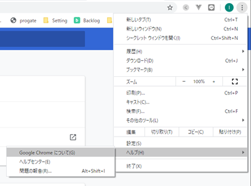
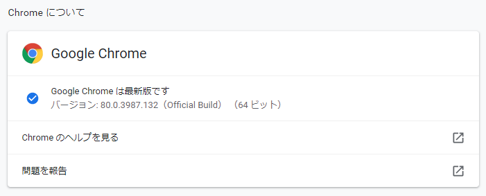
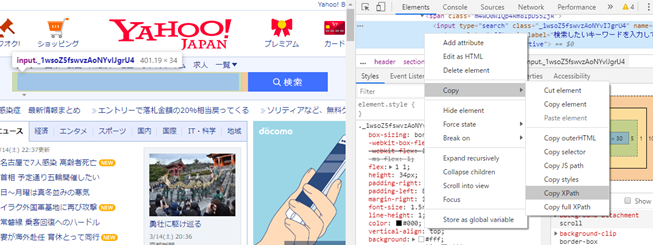

# selenium

selenium入門のための雛形のようなものを作ってみています。

プログラミング初心者、Python始めたての人でもわかる、を目指しています。


## install 方法

```
pip install selenium
```

※Anaconda環境の人は```conda install selenium```


## ChromeDriver の入手

https://chromedriver.chromium.org/downloads

ここで自分のOSとchromeのバージョンに合ったドライバーを拾ってきます。

Chrome のバージョンはここ





この場合はChromeDriver 80.0.3987.106を拾ってきます。

ダウンロードできたら解凍して出てきたchromedriver.exeをdriverフォルダに入れてください。もしくはhello_selenium.pyのドライバの場所を編集してください。

Supports Chrome version 80 と書いてありますね。頭2桁のバージョンが合ってたら良いみたいです。

最新版は先行公開されているバージョンになるのでエラーとなるので注意。


## 要素取得(操作したい場所情報の取得)

右クリックして検証


すると、開発ツール画面が開くので、取得したい要素のところで右クリック → Copy → Copy XPath



クリップボードにその要素のXPathがコピーされているので、

hello_selenium.py内の
find_element_by_xpath()の文字列を置き換えてください。

今回のhello_selenium.pyではYahooの検索ボックスに「selenium」と入力し、検索ボタンをクリックするというのをしています。

適宜入力、クリック部分をコピペして増やしていけば、大体のことはできるはず！